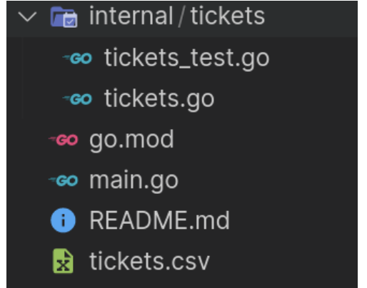

# Bootcamp Go
## Desafío Go Bases💥

### Objetivo
El objetivo de esta guía práctica es que podamos afianzar y profundizar los conceptos vistos en Go Bases. Para esto, vamos a plantear un desafío integrador que nos permitirá repasar los temas que estudiamos.

### Planteo
Una aerolínea pequeña tiene un sistema de reservas de pasajes a diferentes países, este retorna un archivo con la información de los pasajes sacados en las últimas 24 horas.

La aerolínea necesita un programa para extraer información de las ventas del día y así, analizar las tendencias de compra.

El archivo en cuestión es del tipo valores separados por coma (**csv** por su siglas en inglés), donde los campos están compuestos por: **id, name, email, destination country, flight time y price.**

### Desafío
Realizar un programa que sirva como herramienta para calcular diferentes datos estadísticos. Para lograrlo, debes clonar este [Repositorio](https://github.com/bootcamp-go/desafio-go-bases) que contiene un archivo .csv con datos generados y un esqueleto del proyecto.

¡Atención! Los ejemplos a continuación son sólo de guía, el desafío se puede resolver de múltiples maneras.

Requerimiento 1:

Una función que calcule cuántas personas viajan a un país determinado:

func GetTotalTickets(destination string) (int, error) {}

(ejemplo 1)
Tip: VS Code nos permite buscar una palabra en un archivo con Ctrl + F o ⌘ + F.

Requerimiento 2:
Una o varias funciones que calcule cuántas personas viajan en madrugada (0 → 6), mañana (7 → 12), tarde (13 → 19) y noche (20 → 00):

func GetCountByPeriod(time string) (int, error) {}

(ejemplo 2)
Tip: En Go para manipular caracteres tenemos el paquete strings. Si se animan a manipular fechas, el package time

Requerimiento 3:
Calcular el porcentaje de personas que viajan a un país determinado, con respecto al resto:

func AverageDestination(destination string, total int) (float64, error) {}

(ejemplo 3)
Tip: El porcentaje de x se calcula como: 

Requerimiento 4:
Crear test unitarios para cada uno de los requerimientos anteriores, mínimo 2 casos por requerimiento:

import "testing"

func TestGetTotalTickets(t *testing.T) {}

(ejemplo 4)

Tip: Podemos testear múltiples casos en un mismo test.

